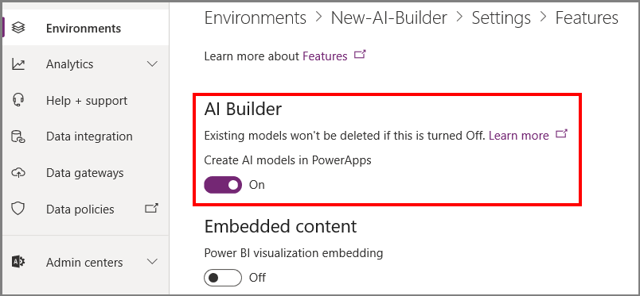

# Administer AI Builder

[!INCLUDE[cc-beta-prerelease-disclaimer](./includes/cc-beta-prerelease-disclaimer.md)]

Power Platform administrators can use the [PowerApps admin center](https://admin.powerapps.com) and the [Power Platform Admin center](https://admin.powerplatform.microsoft.com) to manage environments and settings for PowerApps and AI Builder.

For more information, see the [Power Platform Administrator Guide](https://docs.microsoft.com/power-platform/admin/admin-documentation).

## Supported regions

Your AI model is deployed in the region that hosts the environment. For example, if your environment is created in the Europe region, then your model is deployed in Europe datacenters. For an overview of environments, see [Environments overview](https://docs.microsoft.com/power-platform/admin/environments-overview).

Currently, AI Builder is available in United States and Europe only. AI Builder features will not be available in environments created outside United States or Europe.

## Enable or disable AI Builder feature

Power Platform administrators can use the Power Platform Admin center to control the availability of AI Builder in an environment.

By default, the **AI Builder** feature is set to **On** (enabled) for any eligible environment (environment must have Common Data Service and its region must be supported; either the United States or Europe). If the environment is not eligible, the **AI Builder** feature won't appear in the Power Platform Admin center. 

To control the feature availability:

1. Sign in to the [Power Platform Admin center](https://admin.powerplatform.microsoft.com).
2. In the admin center, go to **Environments** > *[select an environment]* > **Settings** > **Features**.
3. On the **Features** settings page, under **AI Builder (preview)**, enable or disable **Create AI models in PowerApps**.  
    
    > [!div class="mx-imgBorder"]
    > 

Some important points related to enabling or disabling the feature:

- If you set **Create AI models in PowerApps** to **Off** (disabled), it won't delete existing models that users of this environment might have created. However, AI Builder components won't be visible anymore, and existing experiences that leverage existing AI builder components will fail and/or return errors.

- If you set **Create AI models in PowerApps** back to **On** (enabled), the AI Builder components will become visible again and function as they did earlier.

- To delete all AI Builder models from an environment, you must delete each model and then disable the **AI Builder** feature by setting **Create AI models in PowerApps** to **Off** to ensure that users can’t create new models using AI Builder. You must do this on each environment where AI Builder was enabled.

For more information about enabling/disabling features in the Power Platform Admin center, see [Manage feature settings](https://docs.microsoft.com/power-platform/admin/settings-features).

## Backup and restore

Dynamics 365 allows protecting your apps data and providing continuous availability of service thanks to its built-in backup and restore capabilities. For more information, go to [Backup and restore instances](https://docs.microsoft.com/dynamics365/customer-engagement/admin/backup-restore-instances) in PowerApps docs. 

> [!IMPORTANT]
> Currently, AI Builder provides limited support for backup and restore.

A system administrator or delegated admin user can use the standard capabilities described in [Backup and restore instances](https://docs.microsoft.com/dynamics365/customer-engagement/admin/backup-restore-instances). 

After a restore operation, they must manually retrain and republish existing models to make them available again. For more information, go to [Retrain and republish existing models](manage-model.md#retrain-and-republish-existing-models).
