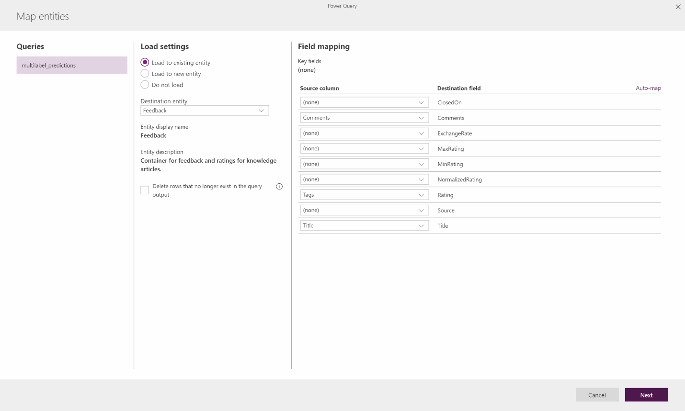

# Before you build a text classification model

Before you build your text classification model, make sure your data is in Common Data Service, and in the correct format.

If you don't have training data and want to try AI Builder Text Classification, you can follow these [instructions](text-classification-sample-data.md) to use sample data.

## Prerequisites

- Training data should be in a Common Data Service entity.
- Make sure your administrator has assigned you a security role with read privilege over the training data.
- You have appropriate permissions to create entities in your Common Data Service environment.
- AI Builder text classification supports the following languages: English, French, German, Dutch, Italian, Spanish, and Portuguese. If you try to classify text items in other languages, your model might not work properly. 

## Data format

- Text and tags should be stored in text fields under the same entity.
- Tags should be separated using a delimiter. We currently support the following delimiters: comma ( , ), semicolon ( ; ), tab, and no separator.
- Tags that contain fewer than 50 text items are ignored.
- Text must be fewer than 5,000 characters.

If we represent data in a table, it would look like this:''

| Text      | Tags                |''
|-----------|---------------------|
| Text data | Tag X, Tag Y        |
| Text data | Tag X, Tag Y, Tag Z |

## Import your data into Common Data Service

Common Data Service includes a powerful set of connectors to help you import data from many sources. For more information, see [Add data to an entity in Common Data Service by using Power Query](/powerapps/maker/common-data-service/data-platform-cds-newentity-pq).

As an example, here is how to import training data from an Excel sheet. This example uses an Excel file like this:

|   |   |   |
|---|---|---|
|326589    |It's a powerful tool that helps make quick changes   |Good \| Quick \| Powerful |
|326590    |This program is great and has lots of potential. The user interface is intuitive and makes it easy to filter results. However, when I try to edit a link, I get an error.    |Potential, Easy \| Good, Ease of Use \| filters \| bug  |
|326591    | You need to work on your feature Y capabilities, they are not as good as your competition. |Feature Y \| Competition     |
|326592    |Easy to view data        |Easy \| Ease of use                                |
|326593    |I like how you made feature X easy to use. This reduces many complexity when I want to onboard new customers. | Easy \|  Good \| Feature X                             |

Note that tags data is separated using a vertical bar or pipe ( \| ).

1. Sign in to [Power Apps](https://make.powerapps.com/), and then select the down arrow to expand **Data** in the navigation pane.
2. Under **Data**, select **Entities**, and then select **Get data** at the top of the screen.
    - If you need to create a new entity, see: [Create a custom entity](https://docs.microsoft.com/powerapps/maker/common-data-service/data-platform-create-entity).
3. In the list of data sources, select **Excel**.
4. Select **Browse** to upload your Excel file,  and then select the sheet or sheets your data is in.
    - You might have to allow third-party cookies for your browser to perform this step.
6. On the **Edit Queries** screen, select **Transform table** > **Use first row as headers**. Next, select the **Tags** column, and then select **Transform Column** > **Replace values**.
1. Replace the vertical bar ( \| ) character with a semicolon ( ; ) and then select **OK**.
1. Now that your data is in the correct format, select **Next** > **Load to new entity** or **Next** > **Load to existing entity** if you already have one.
1. Use the drop-down menu to select your target entity, and then map your columns to the destination field.

    > [!div class="mx-imgBorder"]
    > 

1. Select **Refresh manually** on the **Refresh settings** page.

You're all set—Power Query will import your data into your Common Data Service entity.

### Next step

[Create a text classification model](create-text-classification-model.md)
