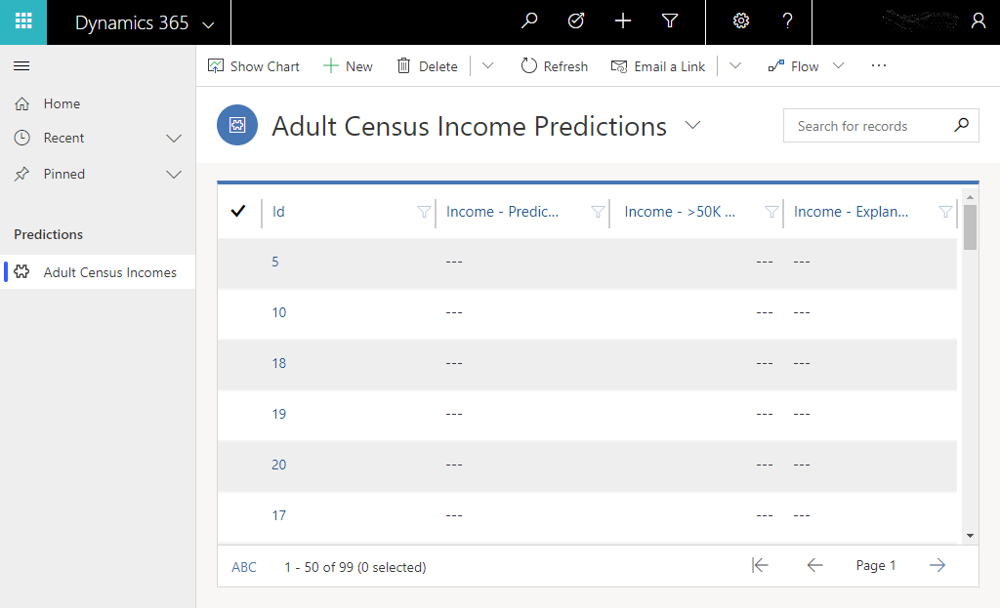

# Use your binary classification model in PowerApps

[!INCLUDE[cc-beta-prerelease-disclaimer](./includes/cc-beta-prerelease-disclaimer.md)]

This topic takes you through the process of creating a model-driven app that can sort your records by the probability value in the AI model output.

> [!NOTE]
> Find more information about model-driven apps [here](/powerapps/maker/model-driven-apps/model-driven-app-overview).  

1. Sign in to [PowerApps](https://web.powerapps.com/), select **Apps** from the menu, and then select **Create an app** > **Model-driven** at the top of the screen.  
1. On the Create a New App screen, complete the fields and then select **Done**.
1. On the **App Designer** screen, you need to do two things:
    - Create a view of your entity that contains the predicted fields from prediction output.
    - Add the view to the site map.
1. Select **Entities** on the **Components** menu, select your entity, and then select **Back**.
1. Select **Save** at the top of the screen so that you don't lose your progress when you create a view, then select **Views** under **Entity view** and select **Create New** on the **Components** tab.
1. Select **Column Attributes – Primary Entity** on the **Components** tab, and then select the fields generated by prediction output.  
1. Select **Save And Close**, give your view a name, and then select the view you just created. Then, select **Save** again. 
1. Select the pencil icon next to **Site Map**, rename **New Group** appropriately. 
Select **New Subarea** and select **Entity** as the **Type**, and then select your entity from the **Entity** dropdown menu.
1. Select **Save And Close** and then select **Publish**.
1. Select **Play**. Your output should look something like this.

    

Congratulations, you've just created your first model-driven app using the binary classification AI model prediction output.
