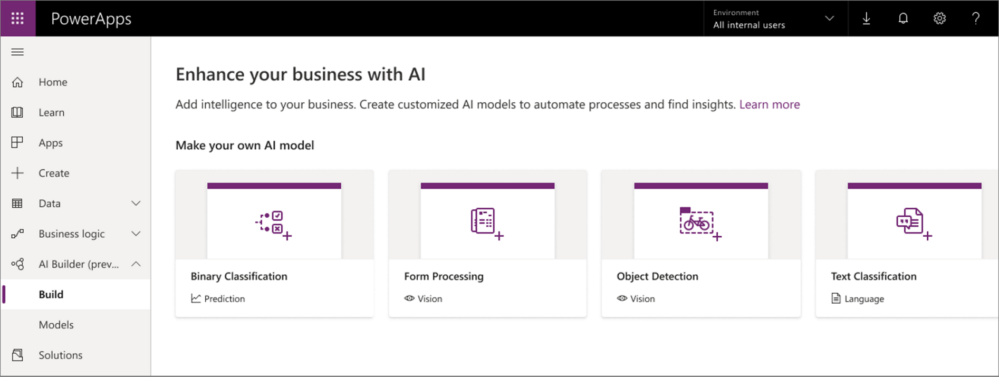

# Build a model in AI Builder 

[!INCLUDE[cc-beta-prerelease-disclaimer](./includes/cc-beta-prerelease-disclaimer.md)]

In AI Builder, we guide you through each step to create your AI model.

## Prerequisites

Make sure your admin has enabled AI Builder for your environment. Otherwise, you won't have access to the AI builder functionality. More information: [Enable or disable AI Builder feature](administer-ai-builder.md#enable-or-disable-ai-builder-feature)

AI Builder requires the use of [Common Data Service](/powerapps/maker/common-data-service/data-platform-intro), which is the data platform for PowerApps and allows you to store and manage business data. Common Data Service is the platform on which Dynamics 365 apps are built so if you’re a Dynamics 365 customer, your data is already in Common Data Service. 

## Get started
To get started:
1. Sign in to [PowerApps](https://web.powerapps.com). 
2.	In the left navigation bar, select **AI Builder (preview)** > **Build**.
3.	Under **Make your own AI model**, select an AI model type.
4.	Type a model name and select **Create**.

### Next steps
[Train a model in AI Builder](train-model-ai-builder.md) 

