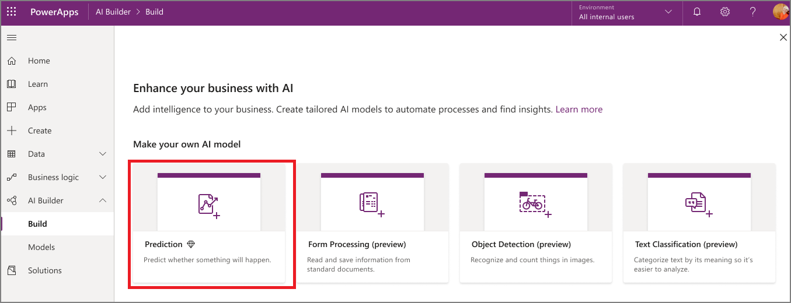

# Create a binary classification model

[!INCLUDE[cc-beta-prerelease-disclaimer](./includes/cc-beta-prerelease-disclaimer.md)]

This example creates a PowerApps binary classification AI model that uses the Adult Census Income Common Data Service entity. 

1. Sign in to [PowerApps](https://web.powerapps.com), and then select **AI Builder (preview)** > **Build**. 
2. Select **Binary Classification**. Enter a model name and then click **Create**.
3. Select **Adult Census Income** as the entity, and **Label** as the field.

## Select the data fields to train your model
After you select the **Entity** and **Label** fields, you have to select different data fields as features to train the model. By default, all data fields are selected. You could deselect data fields that might not be important for your business or which may carry unwanted bias. 
 ### Data field selection considerations
- Make sure that you select the data fields that you want to use in training the model. 
- Deselect the data fields that do not address the problem you want to solve. 
- Deselect the data fields which may carry unwanted bias.
- Make sure the data fields that you select don't have high rate of missing values. If it is a valuable data field, you can assign a default value.
 
> [!NOTE]
> These Common Data Service data types are excluded from the binary classification model. These will not appear in **Field** dropdown menu. 
> - Customer
> - Image
> - Lookup
> - Multiple selection Option set
> - Mulitiline Text
> - Owner
> - Unique Identifier
> - String type data types with length greater than 100 characters 

### Next step
[Train and publish your binary classification model](binary-classification-train-model.md) 
