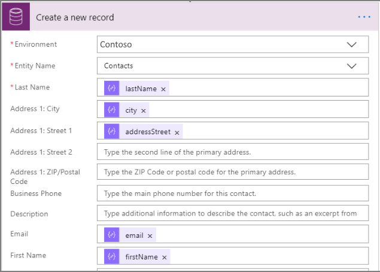

# Use the business card reader prebuilt model in Power Automate

> [!IMPORTANT]
 > To use AI Builder models in Power Automate, you have to create the flow inside a solution. The steps below won't work if you don't follow these instructions first: [Create a flow in a solution](/flow/create-flow-solution).

1. [Sign in](https://flow.microsoft.com/signin) to Power Automate, select the **My flows** tab, and then select **Create from blank**.
1. Search for the term *manually*, select **Manually trigger a flow** in the list of triggers, and then select **+ Add an input**.
1. Select **File**, and set **My Image** as the input title.
1. Select **+ New step**, search for the term *Predict*, and then select **Predict - Common Data Service (Current Environment)** in the list of actions.

5. Select the **BusinessCard model** and specify the following **Request Payload**:

    ```json
    { 
    "base64Encoded": "EXPRESSION", 
    "mimeType": "image/jpeg" 
    }
    ```
6. Replace *EXPRESSION* with the following expression string on the formula bar on the right: 

    ```json
    string(triggerBody()?['file']?['contentBytes'])
    ```
    > [!NOTE]
    > Depending on which connector the file comes from, the expression might need to be enclosed by base64() instead of string().
7. Select **+ New step**, search for *Parse JSON*, and then select **Parse JSON – Data Operations** in the lists of actions.
8. In the **Parse JSON** screen, next to **Content**, select **Response Payload**.
9. Copy and paste the following JSON code into the **Schema** box:

    ```json
    { 
            "type": "object", 
            "properties": { 
                "predictionOutput": { 
                    "type": "object", 
                    "properties": { 
                        "clbeanedImage": { 
                            "type": "object", 
                            "properties": { 
                                "base64Encoded": { 
                                    "type": "string" 
                                }, 
                                "mimeType": { 
                                    "type": "string" 
                                } 
                            } 
                        }, 
                        "contact": { 
                            "type": "object", 
                            "properties": { 
                                "fullName": { 
                                    "type": "string" 
                                }, 
                                "firstName": { 
                                    "type": "string" 
                                }, 
                                "lastName": { 
                                    "type": "string" 
                                }, 
                                "title": { 
                                    "type": "string" 
                                }, 
                                "phone1": { 
                                    "type": "string" 
                                }, 
                                "email": { 
                                    "type": "string" 
                                }, 
                                "companyName": { 
                                    "type": "string" 
                                }, 
                                "department": { 
                                    "type": "string" 
                                }, 
                                "fullAddress": { 
                                    "type": "string" 
                                }, 
                                "addressStreet": { 
                                    "type": "string" 
                                }, 
                                "city": { 
                                    "type": "string" 
                                }, 
                                "country": { 
                                    "type": "string" 
                                } 
                            } 
                        } 
                    } 
                }, 
                "operationStatus": { 
                    "type": "string" 
                }, 
                "error": {} 
            } 
   }

   ```
Congratulations! You've created a flow that uses the business card reader AI model. Select **Save** on the top right, and then select **Test** to try out your flow.

This procedure should give you the basis from which to continue building a flow that suits your needs. The following example shows a new contact being created in Common Data Service using the business card data.

   > 
