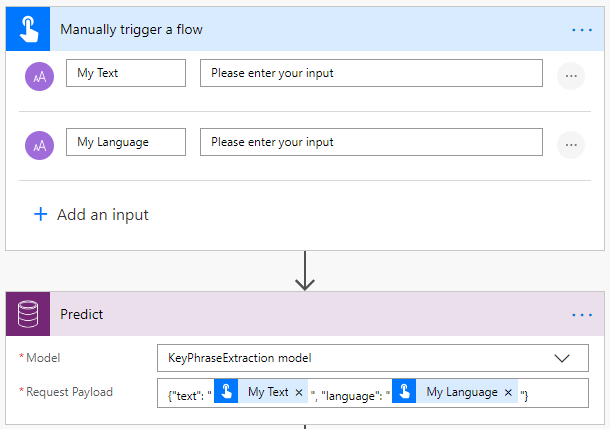
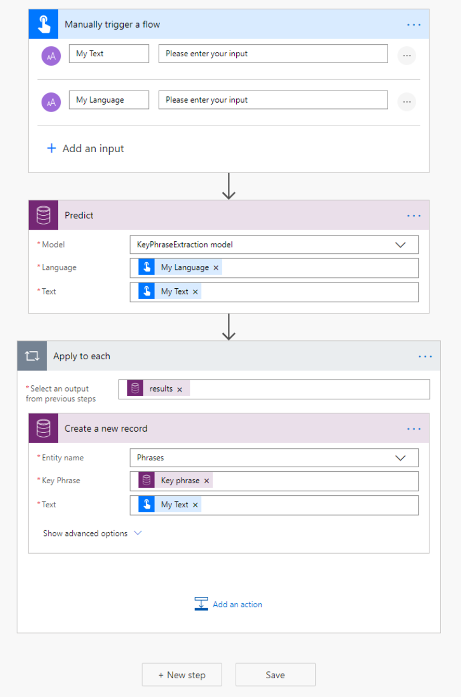

# Use the key phrase extraction prebuilt model in Power Automate

[!INCLUDE[cc-beta-prerelease-disclaimer](./includes/cc-beta-prerelease-disclaimer.md)]

1. [Sign in](https://flow.microsoft.com/signin) to Power Automate, select the **My flows** tab, and then select **Create from blank**.
1. Search for the term *manually*, select **Manually trigger a flow** in the list of triggers, and then select **+ Add an input**.
1. Select **Text** and set as input title: **My Text**.
1. Select **+Add an input** again.
1. Select **Text** and set as input title: *My Language*.
1. Select **+ New step**, search for *Predict*, and then select **Predict Common Data Service (current Environment)** in the list of actions.
1. Select **KeyPhraseExtraction model**, and in the **Request Payload** field, enter *{“text”:”My Text”, “language”:”My Language”}*. Add the **My Text** and **My Language** fields from the trigger.

   
   
1. Select **+ New step**, search for Parse JSON, and then select **Parse JSON – Data Operations** in the lists of actions.
1. In the **Content** field, select **Response Payload**.
1. Copy the following JSON code and paste it into the **Schema** box: 

    ```JSON
          { 
            "type": "object", 
            "properties": { 
                "predictionOutput": { 
                    "type": "object", 
                    "properties": { 
                        "results": { 
                            "type": "array", 
                            "items": { 
                                "type": "object", 
                                "properties": { 
                                    "phrase": { 
                                        "type": "string" 
                                    } 
                                }, 
                                "required": [ 
                                    "phrase" 
                                ] 
                            } 
                        } 
                    } 
                }, 
                "operationStatus": { 
                    "type": "string" 
                }, 
                "error": {} 
            } 
        } 
    ```

   

Now you can iterate through the outputs returned by the key phrase extraction model. In the following example, we add each key phrase to a Common Data Service record.



Congratulations! You have created a flow that leverages a key phrase extraction model. Select **Save** on the top right and then select **Test** to try out your flow.
