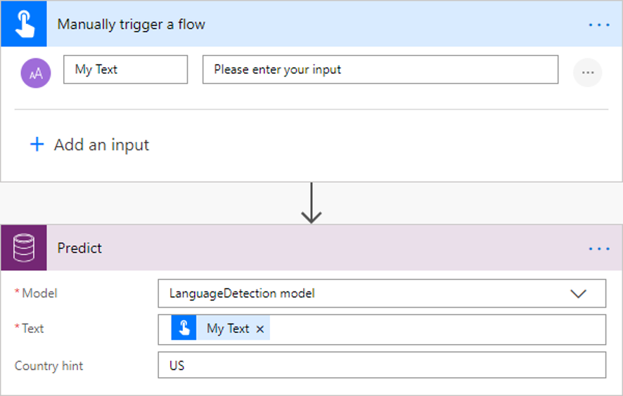
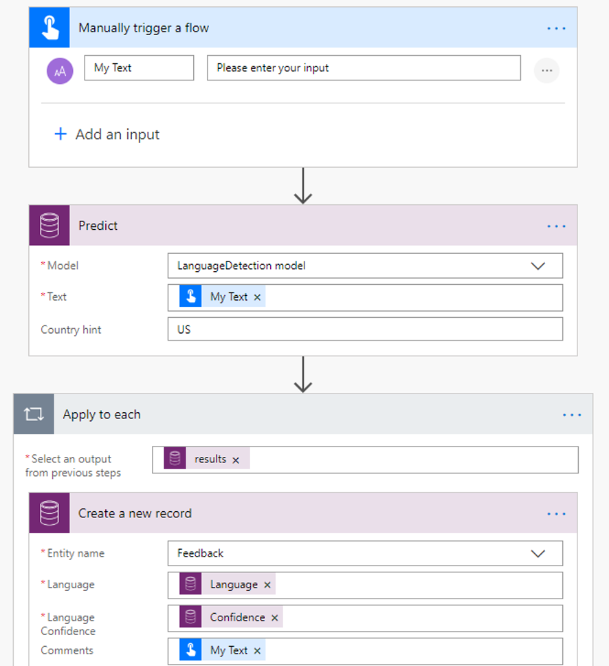

# Use the language detection prebuilt model in Power Automate

> [!IMPORTANT]
 > To use AI Builder models in Power Automate, you have to create the flow inside a solution. The steps below won't work if you don't follow these instructions first: [Create a flow in a solution](/flow/create-flow-solution).

1. [Sign in](https://flow.microsoft.com/signin) to Power Automate, select the **My flows** tab, and then select **Create from blank**.

1. Search for the term *manually*, select **Manually trigger a flow** in the list of triggers, and then select **+ Add an input**.
1. Select **Text** and set as input title: **My Text**.
1. Select **+ New step**, search for the term *Predict*, and then select **Predict Common Data Service (current Environment)** in the list of actions.
    >[!NOTE]
    > **Predict Common Data Service (current Environment)** does not appear if you don't follow these instructions first: [Create a flow in a solution](/flow/create-flow-solution)
1. Select  **LanguageDetection model**. 
1. Specify the **My Text** field from the trigger in the Text input, and then specify the 2-letter country code for your default country. 

   >[!NOTE]
   >You can use the countryHint parameter to specify a 2-letter country code. 
   >
   >For example, "Impossible" is common to English and French languages. With a limited context. the response will be based on the "US" country hint. If the origin of the text is known to be coming from France that can be given as a hint.

   

Now you can iterate through the detected languages returned by the language detection model. In the following example, we add the detected languages to an existing Common Data Service record.

Congratulations! You've created a flow that uses a language detection model. Select **Save** on the top right and then select **Test** to try out your flow.
