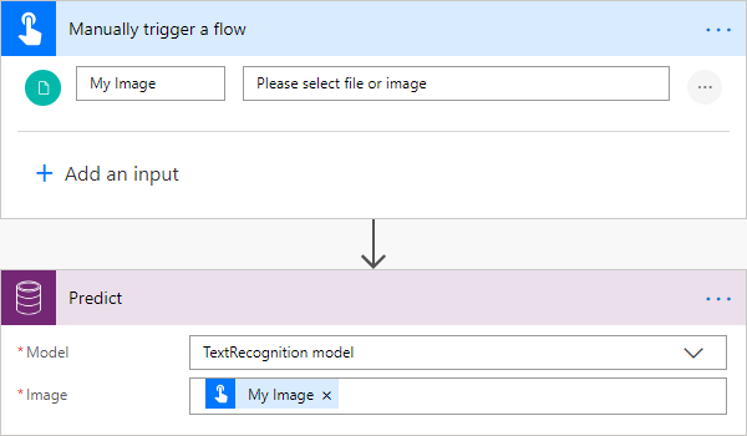
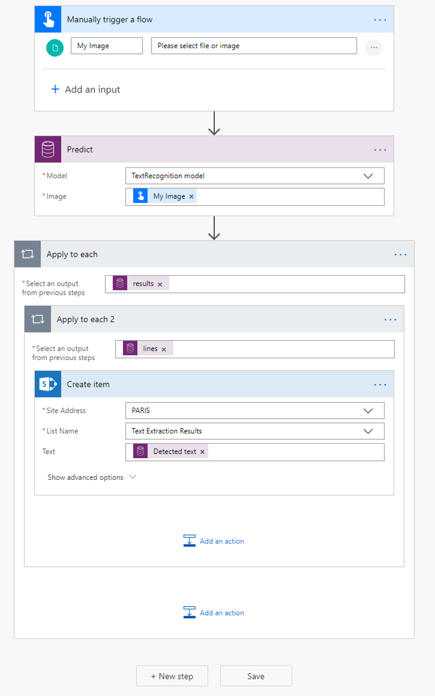

# Use the text recognition prebuilt model in Power Automate

> [!IMPORTANT]
 > To use AI Builder models in Power Automate, you have to create the flow inside a solution. The steps below won't work if you don't follow these instructions first: [Create a flow in a solution](/flow/create-flow-solution).

1. [Sign in](https://flow.microsoft.com/signin) to Power Automate, select the **My flows** tab, and then select **Create from blank**.

1. Search for the term *manually*, select **Manually trigger a flow** in the list of triggers, and then select **+ Add an input**.

1. Select **File** and set **My Image** as the input title.

1. Select **+ New step**, search for the term *Predict*, and then select **Predict - Common Data Service (Conversational Environment)** in the list of actions.
    >[!NOTE]
    > **Predict Common Data Service (current Environment)** does not appear if you don't follow these instructions first: [Create a flow in a solution](/flow/create-flow-solution)

1. Select **Text recognition model**,  and specify the *My Image* field from the trigger in the Image input.

    > 

Now you can use the extracted text lines by the Text Recognition model. In the following example, we save the extracted text to a SharePoint list.

> 

Congratulations! You've created a flow that uses a text recognition model. You can continue to build on this flow until it suits your needs. Select **Save** on the top right, and then select **Test** to try out your flow. 
