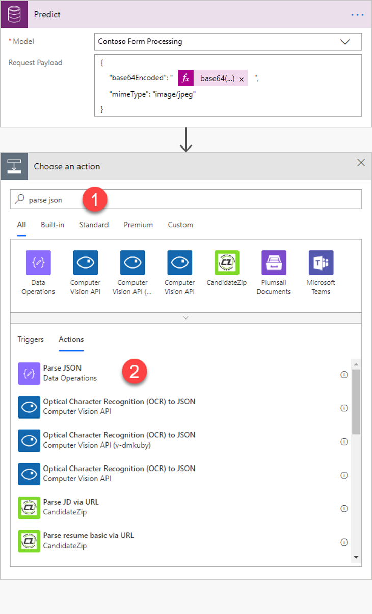

# Use form processing model in Microsoft Power Automate

[!INCLUDE[cc-beta-prerelease-disclaimer](./includes/cc-beta-prerelease-disclaimer.md)]

## Create your flow

1. Sign in to [Power Automate](https://flow.microsoft.com/), select the **My flows** tab, and then select **Create from blank**.
2. Search for *manually*, select **Manually trigger a flow** in the list of triggers, and then select **+Add an input**.
3. Select **File** and set **My Document** as input title.
4. Select **+ New step**, search for **Predict**, and then select **Predict Common Data Service (current Environment)** in the list of actions.
6. Select the form processing model you want to use, and specify the following as **Request Payload**:
    
    -	For a .jpeg image of the form:

        ```json
        {
            "base64Encoded": "EXPRESSION",
    	    "mimeType": "image/jpeg"
        }
        ```

    - 	For a .pdf document of the form:

          ```json
         {
             "base64Encoded": "EXPRESSION",
    	    "mimeType": "application/pdf"
        }
           ```

    - In the formula bar on the right, replace **EXPRESSION** with the following expression:
    
        string(triggerBody()?['file']?['contentBytes'])

        > [!div class="mx-imgBorder"]
        > 
    
 > [!NOTE]
 > Depending on which connector the file comes from, the expression will need to be enclosed by base64() instead of string().

## Test and edit your flow

1. Select **Test** on the upper right, select **I’ll perform the trigger action**,  and then select **Save & Test**.
10.	Import a document that can be processed by your trained form processing model and then select **Run flow**.
12.	Copy the results to an editor like Visual Studio Code and remove all the " \\" characters.
13.	Back on the Flow editor,  select **+ New step**, search for **Parse JSON**, and then select **Parse JSON – Data Operations** from the list of actions.

    > [!div class="mx-imgBorder"]
    > 
    
15.	In the Parse JSON screen, next to **Content**, select **Response Payload**.
16. Select **Use sample payload to generate schema link**, paste the output from your test, and then select **Done**.
18.	Copy the generated schema, paste it into an editor like Visual Studio Code, replace all instances of **integer** with **number**, and then copy the modified schema back into the Parse JSON screen in Power Automate.

    > [!div class="mx-imgBorder"]
    > 

    > [!div class="mx-imgBorder"]
    > 

## Use form processing model output in Power Automate

Now you can use the output of the form processing model in subsequent actions in Power Automate.

For example, to retrieve the value of a field named *Total*, you would use the following expression:  

   ```json
        body('Parse_JSON')?['predictionOutput']?['labels']?['Total']?['value']
```

To iterate over tables, put the entries value on an *Apply to each*' loop. To access the value of a column named *Amount*—for instance, inside the table—use the expression:
    
```json
        items('Apply_to_each')?['Amount']?['value']

```
Congratulations! You have created a flow that leverages an AI Builder form processing model. Select **Save** on the top right, and then select **Test** to try out your flow.

### Related topic
[Form processing model overview](form-processing-model-overview.md)
