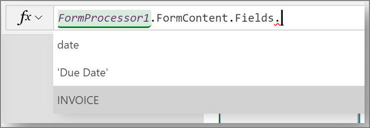

# Use the form processor component in PowerApps

[!INCLUDE[cc-beta-prerelease-disclaimer](./includes/cc-beta-prerelease-disclaimer.md)]

Create a canvas app and add the form processor AI Builder component to your screen. This component takes a photo or loads an image from the local device, and then processes it to extract text based on a trained AI model. If it detects a form that the AI model is trained for, the form processor extracts the field values, and identifies them with rectangles.

> [!NOTE] 
>Support for PDF files is not included in the initial preview.

## Prerequisites
This component requires a trained & published AI Builder form processing model. Then, that model must be bound to the component using the AI model property in the properties panel.
When you add it to the screen, the component automatically opens the AI models pane to select a model from those published in that environment. 

The component is initialized after an AI model is bound to it.

## Properties
### Key properties
- **ModelId** (“AI model” in the properties panel): AI model information to which the component is bound to.
- **OriginalImage**: Output property that contains the original image before processing.
- **FormContent**: Output property that contains the details of extracted form fields and tables. At component initialization (AI model binding step), the potential fields and tables that can be extracted by the models are populated:
- **Fields**:

    
- **Tables**:

     

### Additional properties
- **Text**: Text that appears on the button that activates the form processor.
- **ImageDisplayed** (“Show image” in the properties panel): Whether the component displays the image or not. When set to ON, rectangles are displayed around field values detected in the image.
- 3 different colors can be used to draw the rectangle depending on the confidence level:
    - **Red**: Confidence level is between 0% and 40%.
    - **Orange**: Confidence level is between 40% and 70%.
    - **Blue**: Confidence level is between 70% and 100%.
- **ShowConfidence** (“Show confidence” in the properties panel): Whether the component displays confidence levels along with the rectangles in the image or not.
- **DisplayMode**:
    - **Edit**: Allows user input
    - **View**: Only displays data 
    - **Disabled** is disabled.
- **Height**: The height of the component.
- **Visible**: Whether the component appears or is hidden.
- **Width**: The width of the component.
- **X**: The distance between the left edge of the component and the left edge of its parent container (screen if no parent container).
- **Y**: The distance between the top edge of the component and the top edge of the parent container (screen if no parent container).

Additional design properties are available in the Advanced panel.

## Accessibility guidelines
These guidelines for the PowerApps [Button control](/powerapps/maker/canvas-apps/controls/control-button) also apply to the form processor component.

### Related topics

[Object detection model overview](object-detection-overview.md) 
[Core properties in PowerApps](/powerapps/maker/canvas-apps/controls/properties-core)
