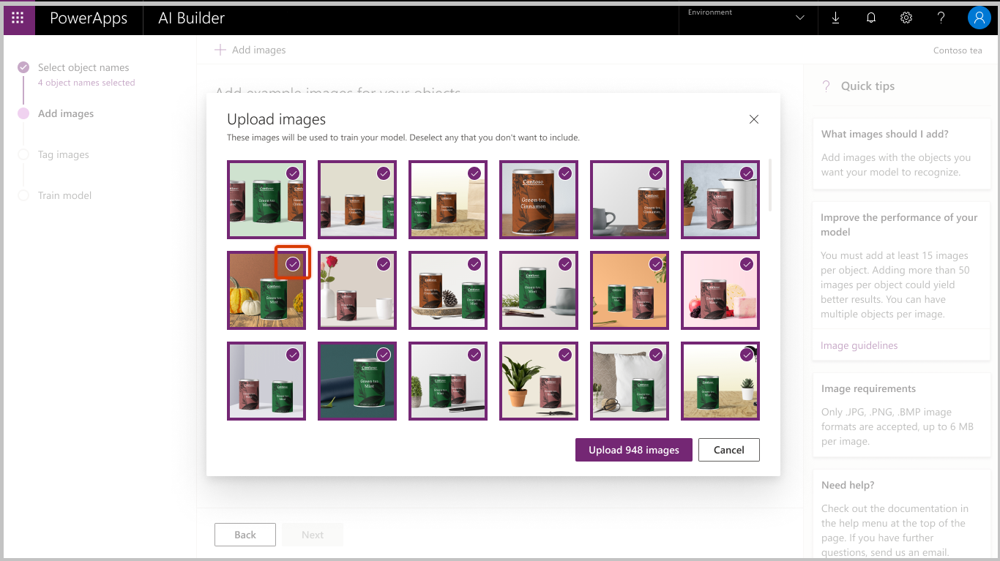
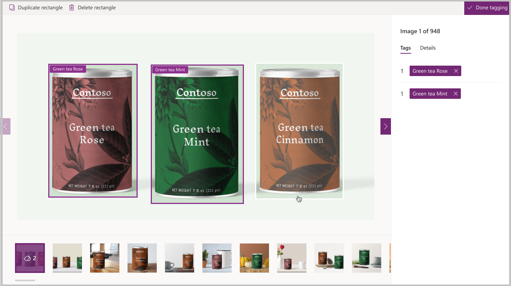

# Get started with object detection

[!INCLUDE[cc-beta-prerelease-disclaimer](./includes/cc-beta-prerelease-disclaimer.md)]

> [!NOTE]
> Make sure your administrator has assigned you a security role with all organization privileges over the entity **Note** from **Core Records** and read privilege over the entity you are using to select object names.

1. Sign in to [PowerApps](https://web.powerapps.com), and then in the navigation pane, select the down arrow to expand **AI Builder**. Select the **Object Detection** AI model type.
2. Enter a name for your model then select **Create**.

## Select object names

In AI Builder, the first step in creating an object detection AI model is to select the names of the items you wish to detect. The names of the items you wish to detect need to be in [Common Data Service](/powerapps/maker/common-data-service/data-platform-intro). If your data is not in Common Data Service, go to the [Prerequisites](build-model.md#prerequisites) topic for information about how to import data into Common Data Service. 
1. Select **Select Object Names** to view the entities in your environment. 
2. In the right-side pane, find the entity that contains your object names by scrolling the list or using the search bar, and select that entity.
3. Locate the field that contains the names of your objects. Select that field, and then select **Select Field** at the bottom of the screen.
4. From the list of strings in your table, select those that represent the objects you want to detect, then select **Next** at the bottom of the screen.

## Upload images
 Now let’s move on to the image upload step in building an object detection AI model. The pictures you collected ahead of time will now come in handy, as you need to upload them to AI builder.

1. Prepare your images in a folder on your computer, and make sure they abide by the qualitative and quantitative [guidance](collect-images.md).
1. In AI Builder, select **Add Images**.
1. Browse your computer file system, and select the images that contain your objects
1. Confirm the images that appear in AI builder before you finish uploading them. Deselect any image you want to exclude.

1. Select **Upload images** to kick off the upload of your images.
1. When the upload is complete, select **Close**.

## Tag images

This section explains the tagging process that is required for object detection. It consists of drawing rectangles around the objects of interest then assigning a name to the rectangle that you want the model to return.

1. On the **Tag** object in your images screen, select the first image in your gallery.
1. To draw a rectangle around an object, press and hold your mouse at the top-left corner of the object then drag down to the bottom-right corner of the object. The rectangle should fully encompass the object you want your model to recognize.

1. After you draw a rectangle, you can associate a name to the object from the list of names you already selected.

 
1. Your tag is created when you see it surrounding an object.

 
1. Navigate from image to image, and tag at least 15 images per object name to build a model. 
1. After you are done tagging your images, select **Done Tagging**. Your data is saved as you create rectangles. 
1. In the grid view, you can view a summary of all the tags you created, and which images you created. This lets you know how much more work is needed to move forward.
1. Until you reach the minimum for content quantity, you won’t be able to move forward. Once you have at least 15 images per object name, you will be able to select **Next** at the bottom of the screen. 

That’s it! Congratulations, you have completed the exercise of creating a training set for object detection.

### Next steps

[Train  your model](object-detection-train-model.md)

### Related topics

[Object detection in Microsoft Flow](object-detection-model-in-flow.md) 
