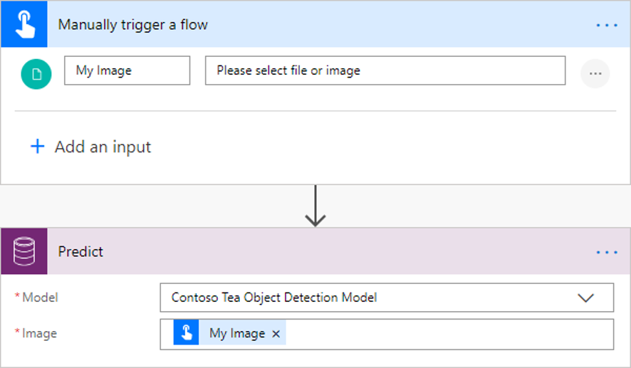

# Use object detection model in Power Automate

[!INCLUDE[cc-beta-prerelease-disclaimer](./includes/cc-beta-prerelease-disclaimer.md)]

> [!IMPORTANT]
 > To use AI Builder models in Power Automate, you have to create the flow inside a solution. The steps below won't work if you don't follow these instructions first: [Create a flow in a solution](/flow/create-flow-solution).

1. Sign in to [Power Automate](https://flow.microsoft.com/), select the **My flows** tab, and then select **Create from blank**.
2. Search for *manually*, select **Manually trigger a flow** in the list of triggers, and then select **+ Add an input**.
3. Select **File**, and set **My Image** as input title.
4. Select **+ New step**, search for *Predict*, and then select **Predict - Common Data Service (Current Environment)** in the list of actions.
    >[!NOTE]
    > **Predict Common Data Service (current Environment)** does not appear if you don't follow these instructions first: [Create a flow in a solution](/flow/create-flow-solution)

    > [!div class="mx-imgBorder"]
    > 

5. Select the object detection model you want to use, and in the **Image** field, specify **My Image** from the trigger:

    > [!div class="mx-imgBorder"]
    > 

9. To retrieve the name of the detected object or objects on the image, add the **Get a record** action from Common Data Service (current Environment).

10. On the **Get a record** screen, select **AI Object Detection Labels** in the **Entity Name** box, and in **Item identifier** enter **tagId**.

    When you add **tagId** as Item identifier, an *apply to each* loop is automatically added. This loops all the object tags that are detected on the image that is provided by the flow trigger.

    You can continue to build your flow to meet your business needs.

Congratulations! You have created a flow that uses an object detection AI Builder model. Select **Save** on the top right, and then select **Test** to try out your flow.

## Example object detection flow

The following example shows the creation of a flow that is triggered by an image. This flow counts the number of green tea bottles in the image. If the number of green tea bottles is below 2, an email is sent to a stock fulfillment manager.

> [!div class="mx-imgBorder"]
> 

To learn more about all the triggers and actions you can use, see [Power Automate documentation](/flow/getting-started).

### Related topic

[Object detection overview](object-detection-overview.md)
