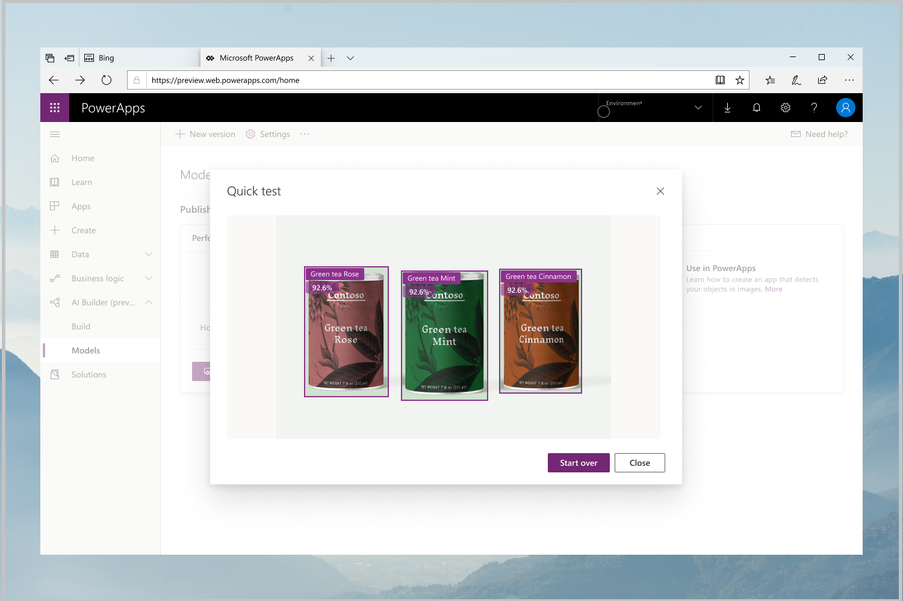

# Train your object detection model

[!INCLUDE[cc-beta-prerelease-disclaimer](./includes/cc-beta-prerelease-disclaimer.md)]

In this section, you’ll learn how to check that you have all the data you need, and then how to train your model.
1.	On the **Train your model** screen, verify that you have the correct names, and the correct amount of images 
2.	If the data is all good, Select **Train** to kick off the training of your object detection model.

## Quick test your model 

Once your model is trained, you can see it in action from its Details page, which you can learn more about here.
1.	From your model details page, select **Quick Test** button in the **Last trained version** section. 
2.	Drag and drop or upload an image which contains your objects to test your model.
3.	Your model will be applied to the image you uploaded. This step might take a little while.
4.	 After your model is done running, the rectangles found will be drawn directly on the picture. 

## Publish your object detection model

From there, you can run more tests with other pictures. If you are happy with the results you are getting, you can [publish](publish-model-ai-builder.md) your model to use it in a Powerapps or Microsoft Flow.

### See also
[Manage your AI model](manage-model-ai-builder.md)
