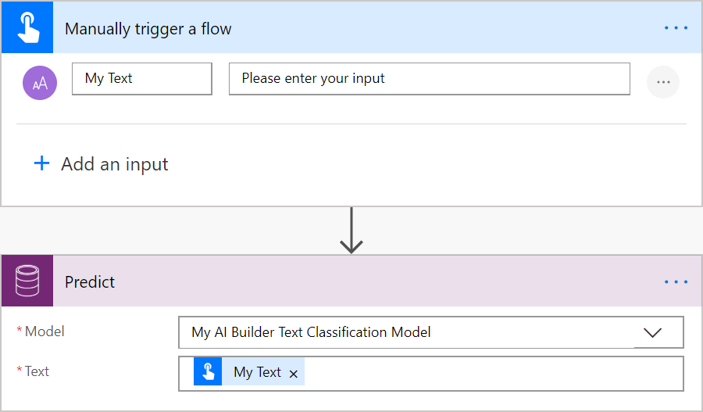
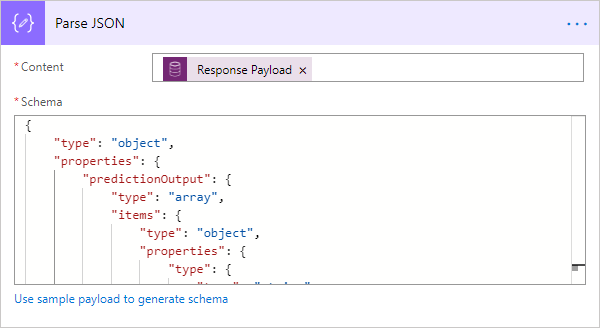

# Use text classification model in Microsoft Flow

[!INCLUDE[cc-beta-prerelease-disclaimer](./includes/cc-beta-prerelease-disclaimer.md)]

1.	Sign in to [Microsoft Flow](https://flow.microsoft.com/), select the **My flows** tab, and then select **Create from blank**.
2.	Search for **manually**, select **Manually trigger a flow** in the list of triggers, and then select **+Add an input**.
3.	Select **Text** and set as input title: **My Text**.
4.	Select **+ New step**, search for **Predict**, and then select **Predict Common Data Service** in the list of actions.
5.	Select the text classification model you want to use, and in the **Request Payload** field, enter **{“text”:”My Text”}**. Add the **My Text** field from the trigger: 

 
6.	Select **+ New step**, search for **Parse JSON**, and then select **Parse JSON – Data Operations** in the lists of actions.
7.	In the **Content** field, select **Response Payload**.
8.	Copy the following JSON, and paste in the **Schema** box:

        {
            "type": "object",
            "properties": {
                "predictionOutput": {
                    "type": "array",
                    "items": {
                        "type": "object",
                        "properties": {
                            "type": {
                                "type": "string"
                            },
                            "score": {
                                "type": "number"
                            }
                        },
                        "required": [
                            "type",
                            "score"
                        ]
                    }
                },
                "operationStatus": {
                    "type": "string"
                },
                "error": {}
            }
        }

9.	Now you can iterate through the outputs returned by the text classification model. In the following example of instance, we save each inferred tag into a SharePoint list. 

Congratulations! You have created a Flow that leverages a text classification AI Builder model. Select **Save** on the top right, and then select **Test** to try out your Flow.

To learn more about the triggers and actions, go to the [Get started with Microsoft Flow](/flow/getting-started) topic.

### Related topics
[Text classification model overview](text-classification-overview.md)