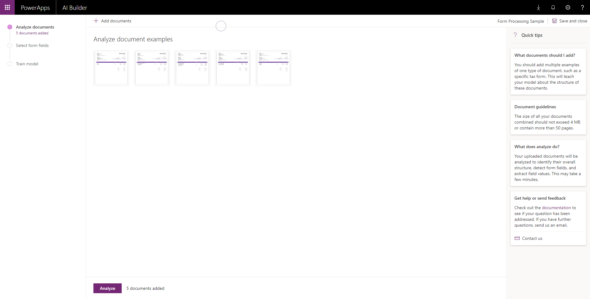
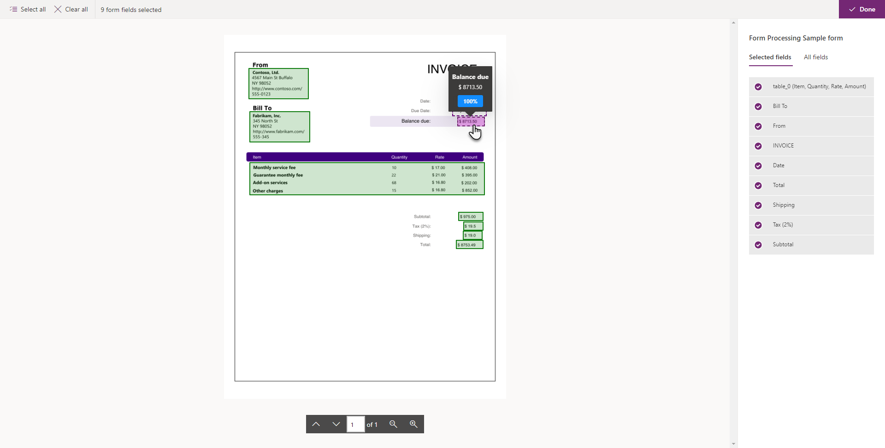

# Use sample data to do Form Processing

[!INCLUDE[cc-beta-prerelease-disclaimer](./includes/cc-beta-prerelease-disclaimer.md)]

To help you explore the possibilities of Form Processing, you can start by building and training a Form Processing model using sample invoices available at this [link](https://github.com/microsoft/PowerApps-Samples/blob/master/ai-builder/labs/AIBuilder_Lab.zip). 

1. Unzip the files after the download has completed. Navigate to the following location: AIBuilder_Lab\Lab Images\FormProcessing_Invoices, in there you will see two folders: train and test.

2. Navigate to the AI Builder build page and pick a Form Processing model.

3. Choose a name for the Form Processing model and create your model.

4. On the first step when creating a Form Processing model, upload the 5 invoices from the **train** folder.

> [!div class="mx-imgBorder"]
> 

5. Next, select the detected fields you wish your model to return.

> [!div class="mx-imgBorder"]
> 

6. Lastly, once you have finished training the model, you can see how it works by doing a quick test using the invoice you will find on the **test** folder.

> [!div class="mx-imgBorder"]
> 

### Related topics
[Form processing model in Flow](form-processing-model-in-flow.md)  
[Form processing model in PowerApps](form-processor-component-in-powerapps.md)
